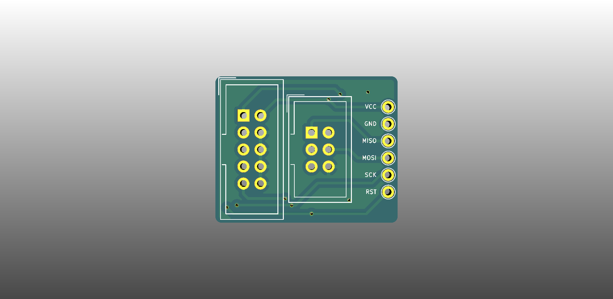

# QBoard BB-AVRISP

Breakout for 10 and 6 pin AVR ISP (In-system Programming) connectors

# Downloads

* [Gerbers](output/gerbers.zip)
* [Schematic](output/schematic.pdf)

# Buy

* [Buy protopack (10) from DirtyPcbs](https://dirtypcbs.com/store/designer/details/qboards/6508/qboard-bb-avrisp)

# About QBoards

See [here](https://github.com/qboards/kicad-boards#about-qboards)

# Licensing

See [here](https://github.com/qboards/kicad-boards#licensing)
