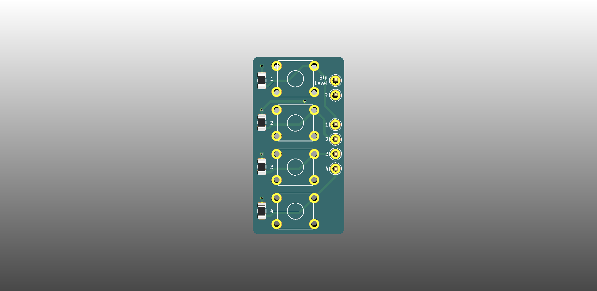

# QBoard BB-ButtonBar

Array of 4 tactile switches on a breakout board. Includes (common) pull-up or
pull-down resistor

# Downloads

* [Gerbers](output/gerbers.zip)
* [Schematic](output/schematic.pdf)

# Buy

* [Buy protopack (10) from DirtyPcbs](https://dirtypcbs.com/store/designer/details/qboards/6509/qboard-bb-button-bar)

# About QBoards

See [here](https://github.com/qboards/kicad-boards#about-qboards)

# Licensing

See [here](https://github.com/qboards/kicad-boards#licensing)
