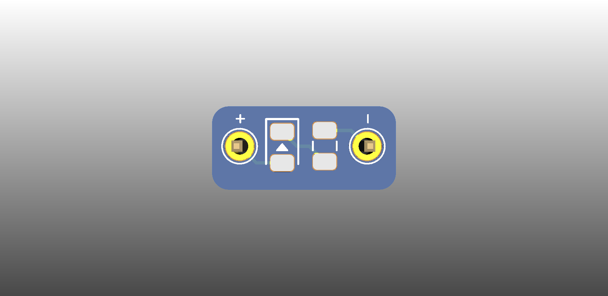

# QBoard BB-Led

Single SMD (0805) breakout board that fits between the bus and the main grid of a breadboard

# Downloads

* [Gerbers](output/gerbers.zip)
* [Schematic](output/schematic.pdf)

# About QBoards

See [here](https://github.com/qboards/kicad-boards#about-qboards)

# Licensing

See [here](https://github.com/qboards/kicad-boards#licensing)
