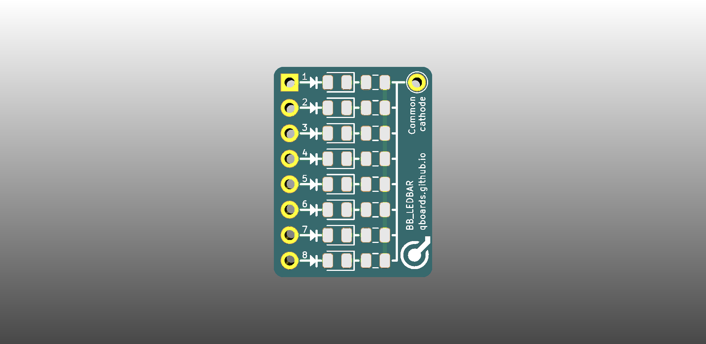

# QBoard BB-LedBar

Array of eight SMD leds (0805) on a breakout board that fits between the bus and the main grid of a breadboard. One side is common cathode, other side common anode.

# Downloads

* [Gerbers](output/gerbers.zip)
* [Schematic](output/schematic.pdf)

# Buy

* [Buy protopack (10) from DirtyPcbs](https://dirtypcbs.com/store/designer/details/qboards/6375/qboard-bb-led)

# About QBoards

See [here](https://github.com/qboards/kicad-boards#about-qboards)

# Licensing

See [here](https://github.com/qboards/kicad-boards#licensing)
