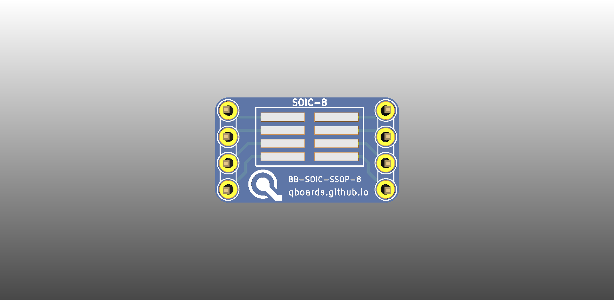

# QBoard BB-SOIC-SSOP-8

Breakout board for SOIC/SSOP IC packages up to 8 pins. Uses extra long and wide pads so
a lot of different packages should fit. To use, just solder your IC on the SOIC or the
SSOP side (only ever use one IC, as the header pins are shared) and you can breadboard
your IC.

Package properties:

|             |  SOIC  |   SSOP  |
|:-----------:|:------:|:-------:|
| Pad count   | 8      | 8       |
| Pad pitch   | 1.27mm | 0.635mm |
| Pad width   | 0.8mm  | 0.4mm   |
| Pad length  | 4.2mm  | 4.2mm   |
| Row spacing | 5.2mm  | 5.2mm   |

# Downloads

* [Gerbers](output/gerbers.zip)
* [Schematic](output/schematic.pdf)

# Buy

* [Buy protopack (10) from DirtyPcbs](http://dirtypcbs.com/store/designer/details/qboards/6373/qboard-bb-soic-ssop-8)

# About QBoards

See [here](https://github.com/qboards/kicad-boards#about-qboards)

# Licensing

See [here](https://github.com/qboards/kicad-boards#licensing)
