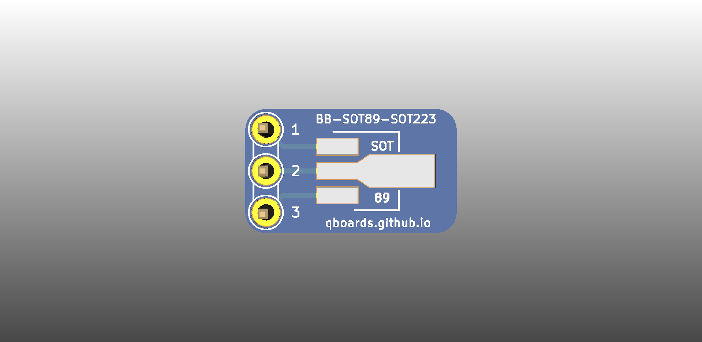

# QBoard BB-SOT89-SOT223

Breakout board for SOT-89 / SOT-223 smd transitor packages. To use, just solder your 
component on the SOT-89 or the SOT-223 side (only ever use one side, as the header pins 
are shared) and you can breadboard your component.

# Downloads

* [Gerbers](output/gerbers.zip)
* [Schematic](output/schematic.pdf)

# Buy

* [Buy protopack (10) from DirtyPcbs](https://dirtypcbs.com/store/designer/details/qboards/6378/bb-sot89-sot223)

# About QBoards

See [here](https://github.com/qboards/kicad-boards#about-qboards)

# Licensing

See [here](https://github.com/qboards/kicad-boards#licensing)
