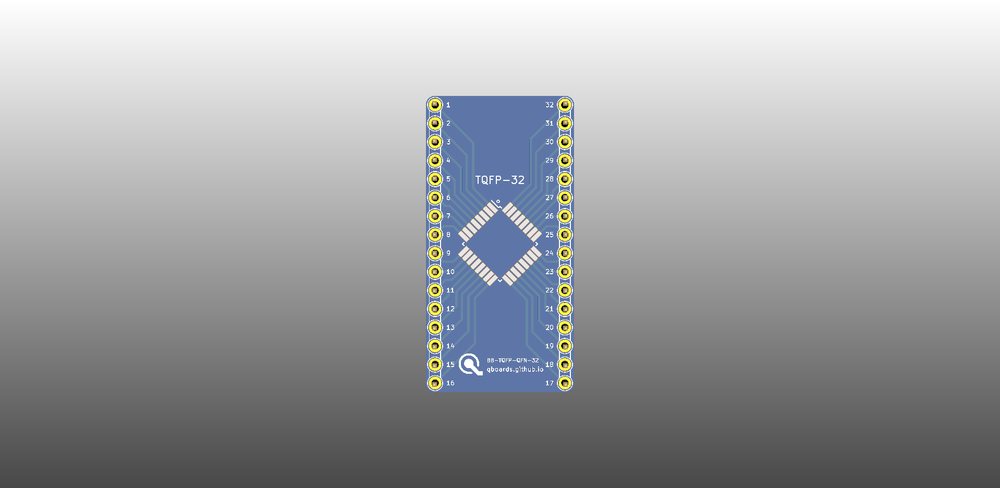

# QBoard BB-TQFP/QFN

Breakout board for TQFP/QFN IC packages of 32 pins. To use, just solder your IC 
on the TQFP or the QFN side (only ever use one IC, as the header pins are shared) 
and you can breadboard your IC.

Package properties:

TQFP: 32pin 7x7mm, 0.8mm pin spacing
QFN: 32pin 5x5mm, 0.5mm pin spacing

# Downloads

* [Gerbers](output/gerbers.zip)
* [Schematic](output/schematic.pdf)

# Buy

* [Buy protopack (10) from DirtyPcbs](http://dirtypcbs.com/store/designer/details/qboards/6377/qboard-bb-tqfp-qfn)

# About QBoards

See [here](https://github.com/qboards/kicad-boards#about-qboards)

# Licensing

See [here](https://github.com/qboards/kicad-boards#licensing)
